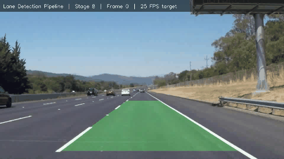
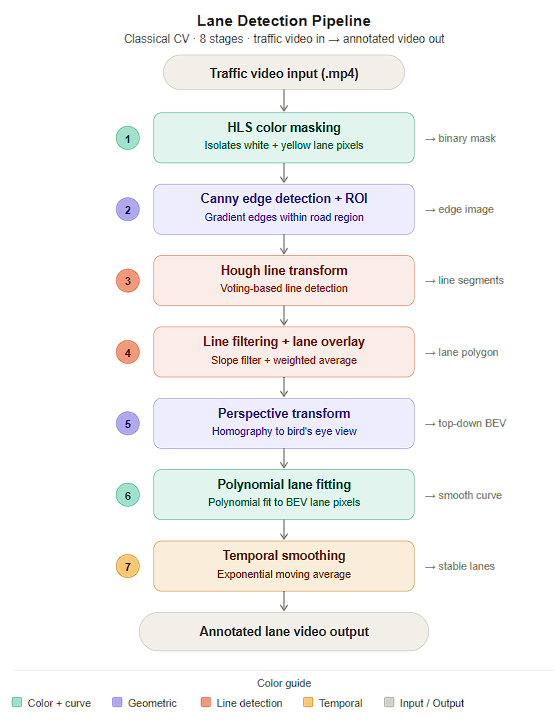
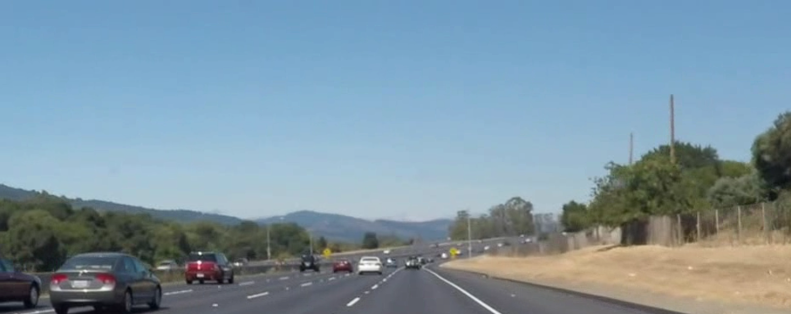
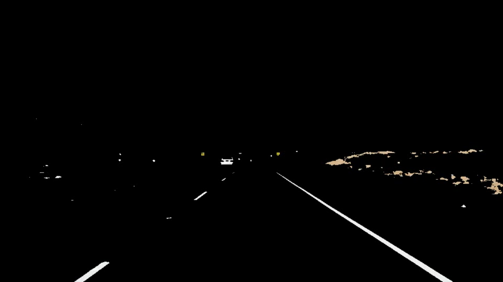
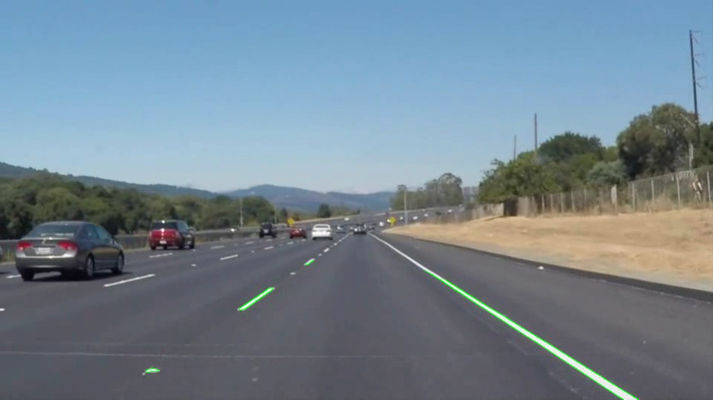
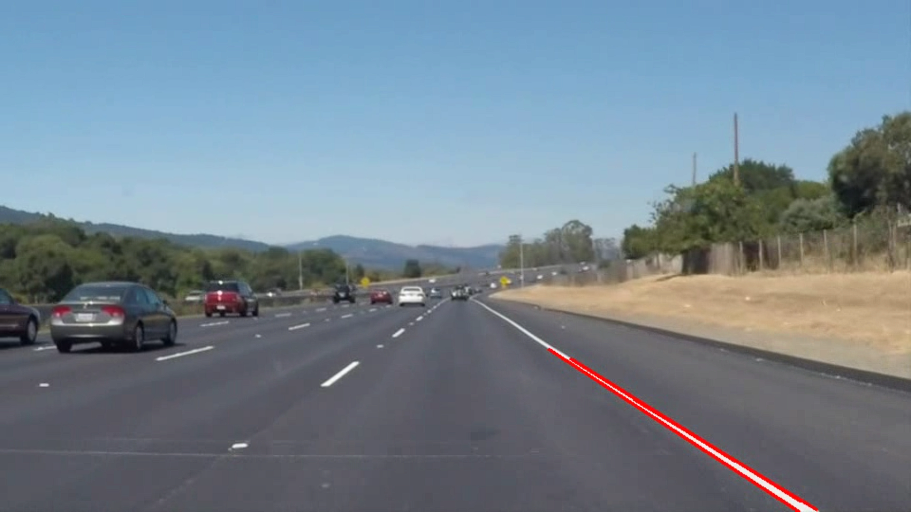
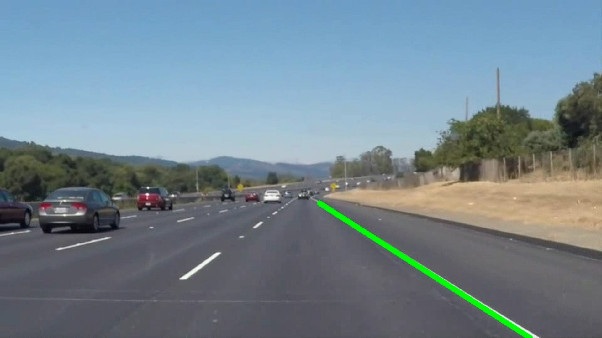
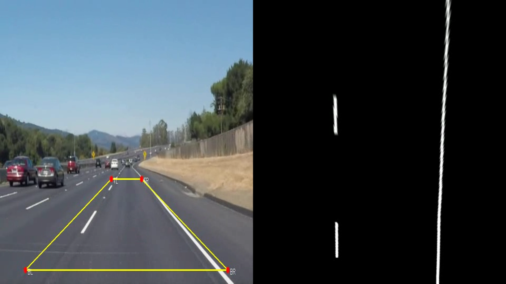
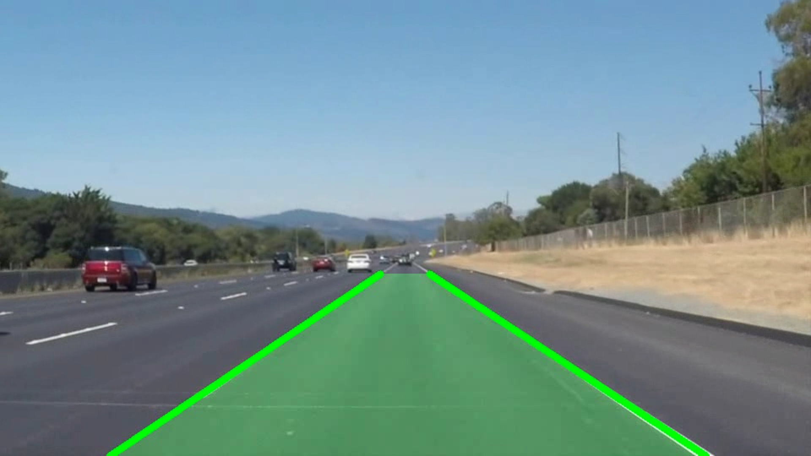
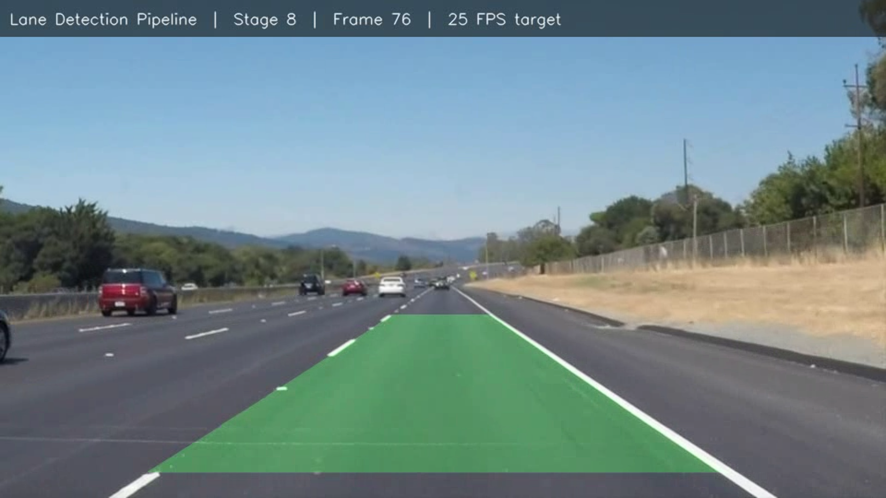

# Lane Detection Pipeline

> Classical computer vision pipeline for real-time lane detection in traffic video.
> Built from scratch using OpenCV and NumPy — no deep learning required.


---

## Demo



---

## Pipeline Architecture



---

## Stage-by-Stage Visual Progression

| Stage 1 — Raw input | Stage 2 — Color mask |
|---|---|
|  |  |

| Stage 3 — Edges + ROI | Stage 4 — Hough lines |
|---|---|
|  |  |

| Stage 5 — Lane overlay | Stage 6 — Bird's eye view |
|---|---|
|  |  |

| Stage 7 — Polynomial fit | Stage 8 — Full pipeline |
|---|---|
|  |  |

---

## Before / After

| Raw input | Final output |
|---|---|
|  |  |

---

## What This Project Does

Takes a dashcam/traffic video as input and outputs an annotated video with:
- Lane markings detected and highlighted
- A filled polygon showing the drivable lane area
- Temporal smoothing to stabilise detection across frames
- Stage-by-stage pipeline outputs for visual debugging

---

## Key Concepts Implemented

**HLS Color Filtering**
Lane markings are isolated using the HLS color space instead of RGB.
HLS separates hue from lightness — making yellow detection robust
under different lighting conditions. White lanes are isolated using
a grayscale brightness threshold.

**Canny Edge Detection**
Gaussian blur followed by gradient-based edge detection. Double
threshold with hysteresis connects strong edges and discards noise.

**Hough Line Transform**
Voting-based algorithm that detects straight lines from scattered
edge pixels. Each pixel votes for every line it could belong to —
accumulation peaks indicate real lane lines.

**Perspective Transform (Homography)**
A 3x3 matrix maps pixels from the camera view to a top-down
bird's eye view. This corrects for the camera angle and makes
parallel lanes appear parallel — a fundamental concept in ADAS
and sensor fusion systems.

**Polynomial Lane Fitting**
Second-degree polynomial x = ay² + by + c fitted to lane pixels
in BEV space. Works on both straight and curved roads where
Hough lines fail.

**Temporal Smoothing**
Exponential moving average of polynomial coefficients across frames.
Prevents lane dropout during dashed line gaps by blending current
detections with recent history — same principle as Kalman filtering.

---

## Project Structure
```
lane-detection-pipeline/
│
├── src/
│   ├── video_io.py          # Video capture and writer utilities
│   ├── color_mask.py        # HLS and grayscale color filtering
│   ├── edge_detection.py    # Canny edge detection and ROI masking
│   ├── hough.py             # Hough line transform and drawing
│   ├── lane_lines.py        # Line filtering, averaging, lane overlay
│   ├── perspective.py       # Perspective transform and BEV warp
│   ├── lane_fit.py          # Polynomial fitting and projection
│   └── smoother.py          # Temporal smoothing across frames
│
├── config/
│   └── default.yaml         # All tunable parameters — no hardcoding
│
├── tests/
│   ├── test_color_mask.py
│   ├── test_edge_detection.py
│   └── test_smoother.py
│
├── docs/                    # Screenshots and demo GIF
├── data/                    # Input video files
├── output/                  # Generated output videos
├── main.py                  # CLI entry point
├── conftest.py              # pytest path configuration
├── requirements.txt
└── .github/workflows/ci.yml
```

---

## Setup
```bash
git clone https://github.com/SHIVCHAUDHARY17/lane-detection-pipeline.git
cd lane-detection-pipeline
python -m venv venv
venv\Scripts\Activate.ps1      # Windows
pip install -r requirements.txt
```

---

## Usage
```bash
# Run a specific stage
python main.py --stage 8

# Run all stages
python main.py --stage 1
python main.py --stage 2
python main.py --stage 3
python main.py --stage 4
python main.py --stage 5
python main.py --stage 6
python main.py --stage 7
python main.py --stage 8

# Run tests
pytest tests/ -v
```

---

## Configuration

All parameters live in `config/default.yaml` — no hardcoded values anywhere.
```yaml
color_mask:
  white_threshold: 200
  hls_yellow_lower: [15, 100, 100]
  hls_yellow_upper: [35, 255, 255]

canny:
  blur_kernel: 5
  low_threshold: 50
  high_threshold: 150

smoother:
  alpha: 0.7
  max_age: 10
```

---

## CV Bullet Points

- Built a **classical CV lane detection pipeline** using HLS color
  filtering, Canny edge detection, and Hough line transform
- Implemented **perspective transform (homography)** to generate
  bird's eye view for geometric lane reasoning
- Applied **polynomial lane fitting** in BEV space projected back
  to camera view using inverse homography
- Designed **temporal smoothing** using exponential moving average
  to eliminate flickering on dashed lane markings
- Built **config-driven modular pipeline** with CLI stage selection,
  pytest test suite (8 tests), and GitHub Actions CI

---

## Tech Stack

- Python 3.11 · OpenCV 4.13 · NumPy · PyYAML · pytest · GitHub Actions

---

## Author

**Shiv Jayant Chaudhary** — Computer Vision and Machine Learning Engineer

[LinkedIn](https://linkedin.com/in/shiv1716) · [GitHub](https://github.com/SHIVCHAUDHARY17)
